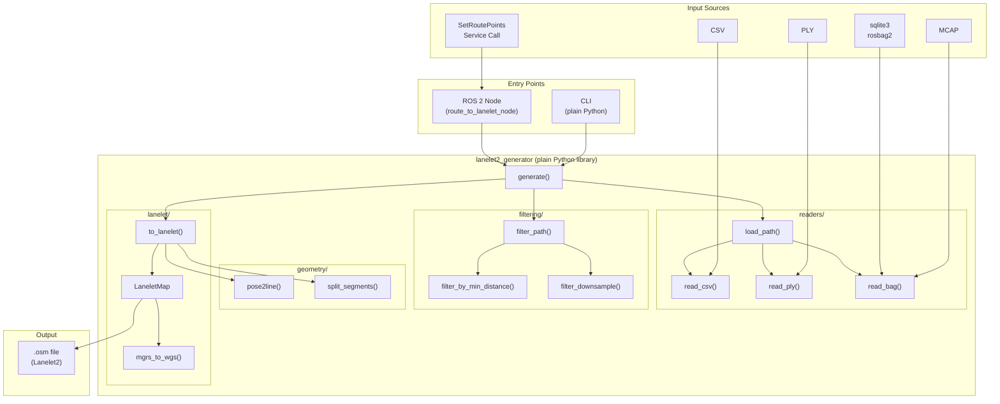

# lanelet2_generator

Generate Lanelet2 maps from path data. Supports multiple input formats and a ROS 2 service for route-based generation.

This package is based on [bag2lanelet](https://github.com/autowarefoundation/autoware_tools/tree/main/bag2lanelet) by the Autoware Foundation.

## Architecture



### Component Overview

| Component | Type | Description |
|-----------|------|-------------|
| **Library** | Plain Python | `import lanelet2_generator` — no ROS dependency |
| **CLI** | Plain Python | `python -m lanelet2_generator.cli` or `lanelet2_generator` (pip) |
| **ROS Node** | ROS 2 only | `route_to_lanelet_node` — SetRoutePoints service |

### Data Flow

All inputs produce an `(N, 7)` pose array `[x, y, z, qx, qy, qz, qw]` that flows through:

1. **Readers** — parse input format into normalized poses
2. **Filtering** — reduce point density (downsample, min distance)
3. **Geometry** — compute left/right/center boundary lines, determine split points
4. **Lanelet** — build OSM XML with nodes, ways, relations; convert MGRS to WGS84

## Features

- **Input formats:** CSV, PLY, MCAP bag, sqlite3 rosbag2
- **Path filtering:** Min distance, downsampling (step)
- **Lanelet splitting:** Max length, direction-change split (as in bag2lanelet)
- **ROS 2 service:** `/api/routing/set_route_points` to generate lanelet2 from route waypoints

## Installation

### Library and CLI (standalone)

```bash
pip install -e .
# For bag/MCAP support, also: pip install -e ".[ros]"
```

### ROS 2 (node + launch)

```bash
sudo apt install ros-$ROS_DISTRO-tf-transformations
pip install -r requirements.txt
cd /path/to/vifware_ws
colcon build --packages-select lanelet2_generator
source install/setup.bash
```

## Usage

### CLI (plain Python, not ROS)

**Syntax:**

```bash
python -m lanelet2_generator.cli <input> <output_dir> [options]
# or, after pip install:
lanelet2_generator <input> <output_dir> [options]
```

**Examples:**

```bash
# From CSV
python -m lanelet2_generator.cli waypoints.csv ./output -l 3.0 -m 33TWN

# From PLY
python -m lanelet2_generator.cli trajectory.ply ./output -l 2.5 -m 33TWN

# From MCAP bag (requires ROS env / rosbag2)
source /opt/ros/humble/setup.bash
python -m lanelet2_generator.cli recorded.mcap ./output -l 3.0 -m 33TWN

# From rosbag2 directory (sqlite3)
python -m lanelet2_generator.cli /path/to/bag ./output -l 3.0 -m 33TWN
```

**CLI parameters:**

| Option | Type | Default | Description |
|--------|------|---------|-------------|
| `input` | path | (required) | Input: CSV, PLY, MCAP file, or rosbag2 directory |
| `output_lanelet` | path | (required) | Output directory for .osm file |
| `-l`, `--width` | float | 2.0 | Lane width [m] |
| `-m`, `--mgrs` | string | 33TWN | MGRS code |
| `-s`, `--speed-limit` | float | 30 | Speed limit [km/h] |
| `--offset` | float float float | 0 0 0 | Offset [m] from centerline (x y z) |
| `--center` | flag | false | Add centerline to lanelet |
| `--min-distance` | float | — | Min distance [m] between consecutive points |
| `--step` | int | 1 | Downsample: keep every Nth point (CSV/PLY only) |
| `--interval` | float float | 0.1 2.0 | [Bag/MCAP only] Min and max interval [m] between tf poses |
| `--split-distance` | float | 500 | Split lanelet every M meters along path |
| `--split-direction` | float float | — | Split when direction changes more than DEG deg within M m (e.g. `80 30`) |

### ROS 2 service node (only ROS component)

```bash
# Launch with default output path
ros2 launch lanelet2_generator route_to_lanelet.launch.xml output_path:=/tmp/lanelet_maps

# With custom params
ros2 launch lanelet2_generator route_to_lanelet.launch.xml \
  output_path:=/data/maps/lanelet \
  mgrs:=33TWN \
  width:=3.0
```

The node advertises `/api/routing/set_route_points` (`autoware_adapi_v1_msgs/srv/SetRoutePoints`). When called with goal and waypoints, it generates a lanelet2 map and saves it to the configured output path.

**Launch parameters:**

| Parameter | Default | Description |
|-----------|---------|-------------|
| `output_path` | /tmp/lanelet_maps | Directory where .osm files are saved |
| `mgrs` | 33TWN | MGRS code |
| `width` | 2.0 | Lane width [m] |
| `speed_limit` | 30 | Speed limit [km/h] |
| `min_distance` | — | Min distance [m] between points |
| `step` | 1 | Downsample step |
| `split_distance` | 500 | Split every M meters |
| `split_direction_deg` | — | Split on direction change [deg] |
| `split_direction_window_m` | — | Direction change window [m] |

### Python API

```python
from lanelet2_generator import load_path, filter_path, generate

# Load and generate
poses = load_path("waypoints.csv")
poses = filter_path(poses, min_distance=0.5, step=2)
path = generate(poses=poses, output_dir="./output", mgrs="33TWN", width=2.0)
```

## Input formats

| Format | Extension | Format |
|--------|-----------|--------|
| CSV | .csv | x, y, z, yaw, velocity, change_flag |
| PLY | .ply | Vertices: x, y, z, q_w, q_x, q_y, q_z |
| MCAP | .mcap | /tf with base_link |
| rosbag2 | directory | /tf with base_link (sqlite3) |

## Output

- `.osm` file (Lanelet2 / OSM format) saved as `YY-MM-DD-HH-MM-SS-lanelet2_map.osm`
- Compatible with Autoware and Vector Map Builder

## Limitations

- MGRS to WGS84 conversion may produce jagged lanes; post-process in Vector Map Builder for refinement.
- Requires `autoware_adapi_v1_msgs` for the route service node.

## Changes in v0.2.0

The following issues from v0.1.0 have been resolved:

- **Standalone Python support**: Replaced `tf_transformations` (ROS) with pure numpy quaternion math. Bag reader imports are deferred. `pip install lanelet2_generator` now works without ROS for CSV/PLY inputs.
- **Removed `np.float` monkey-patch**: No longer needed since `tf_transformations` is no longer imported.
- **Removed hardcoded `poses[::10]`**: Bag inputs now go through the same `load_path()` + `filter_path()` pipeline as CSV/PLY. The `step` and `min_distance` parameters work for all input formats.
- **Fixed service topic name**: Node now registers on `/api/routing/set_route_points` (matching the Autoware ADAPI convention) and the log message matches.
- **Vectorized geometry**: `pose2line()`, yaw extraction, and CSV reading are now fully vectorized numpy operations (no per-point Python loops).
- **O(n) segment splitting**: `split_segments()` uses precomputed cumulative distances and binary search instead of O(n^2) backward walks.
- **Sub-meter coordinate precision**: `LaneletMap` now caches a single `Transformer` per map and computes lat/lon from float UTM coordinates instead of truncated integer MGRS strings.
- **Fixed MGRS northing cycle**: Improved the latitude band cycle calculation to produce correct absolute coordinates for common MGRS codes.
- **Consistent MGRS defaults**: All components default to `"33TWN"`.
- **Always keep last point**: `filter_by_min_distance()` and `filter_downsample()` now always preserve the path endpoint.
- **Input validation**: CSV reader validates column count; PLY reader validates vertex properties with clear error messages.
- **Simplified `generate()`**: Single code path for all inputs; validates `output_dir` before any I/O.
- **Removed unused code**: `save_osm()` wrapper, unused `ResponseStatus` import, dead `scripts/` entry point.
- **Removed `transforms3d` dependency**: The library now only needs `numpy`, `pyproj`, and `plyfile`.

## Future Improvements

**1. Add unit tests**

There are currently no tests. The FSD (T1-T3) calls for:
- Unit tests for readers, filtering, geometry, and lanelet builder
- Integration test with the sample CSV
- Regression test ensuring splitting matches bag2lanelet behavior

**2. Add type hints to public API**

Functions like `load_path()`, `filter_path()`, `generate()`, and `to_lanelet()` have no type annotations. Adding parameter types and return annotations would improve IDE support and catch bugs early.

**3. Configurable output filename**

The output filename is always `YY-MM-DD-HH-MM-SS-lanelet2_map.osm`. Adding `--output-name` (CLI) / `output_filename` (API) would let users specify a fixed name, useful in CI pipelines or automated workflows.

**4. Add `.gitignore`**

No `.gitignore` exists in the package. Should ignore `*.osm` output, `__pycache__/`, `*.egg-info/`, and build artifacts.

**5. Optional parameter handling in ROS node**

Optional float parameters use `""` (empty string) as default and a helper `_opt_float()` to convert. Using ROS 2 parameter descriptors or conditional declaration would be cleaner.

**6. Add `pre-commit` hooks**

Add `black`, `ruff`, and optionally `mypy` via `pre-commit` for consistent code style and static analysis.

**7. Southern hemisphere MGRS**

The MGRS parser has not been validated for southern hemisphere coordinates. Northern hemisphere codes (like 33TWN, 33TWN) work correctly.

## License

Apache License 2.0
