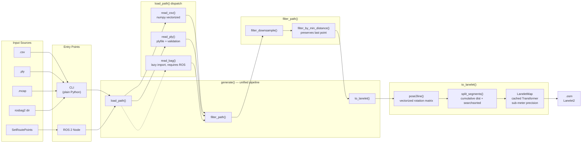

# lanelet2_generator

Generate Lanelet2 maps from path data. Supports multiple input formats and a ROS 2 service for route-based generation.

This package is based on [bag2lanelet](https://github.com/autowarefoundation/autoware_tools/tree/main/bag2lanelet) by the Autoware Foundation.

## Architecture

### Package Layout

```
lanelet2_generator/
├── lanelet2_generator/               # Plain Python library (no ROS)
│   ├── __init__.py                   #   generate() entry point, lazy read_bag import
│   ├── cli.py                        #   CLI: argparse → generate()
│   ├── readers/
│   │   ├── base.py                   #   load_path() — dispatches by file extension
│   │   ├── csv.py                    #   read_csv() — vectorized yaw→quaternion
│   │   ├── ply.py                    #   read_ply() — with input validation
│   │   └── bag.py                    #   read_bag() — lazily imported (requires ROS)
│   ├── filtering/
│   │   └── path.py                   #   filter_path(), min_distance, downsample
│   ├── geometry/
│   │   └── path.py                   #   pose2line() vectorized, split_segments() O(n)
│   └── lanelet/
│       └── builder.py                #   LaneletMap, to_lanelet(), cached Transformer
├── lanelet2_generator_node/          # ROS 2 node (only ROS component)
│   └── route_to_lanelet_node.py      #   /api/routing/set_route_points service
├── launch/
│   └── route_to_lanelet.launch.xml
├── sample_data/
├── CMakeLists.txt
├── package.xml
├── pyproject.toml
└── requirements.txt
```

### Data Flow



### Component Overview

| Component | Type | Dependencies | Description |
|-----------|------|--------------|-------------|
| **Library** | Plain Python | numpy, pyproj, plyfile | `import lanelet2_generator` — works without ROS |
| **CLI** | Plain Python | library only | `python -m lanelet2_generator.cli` or `lanelet2_generator` (pip) |
| **Bag reader** | Plain Python | rclpy, rosbag2_py | Lazily imported only when reading .mcap or rosbag2 dirs |
| **ROS Node** | ROS 2 | library + autoware_adapi_v1_msgs | `/api/routing/set_route_points` service |

### Pipeline

All inputs produce an `(N, 7)` pose array `[x, y, z, qx, qy, qz, qw]` that flows through a single unified pipeline:

1. **`load_path()`** — dispatches by file extension to `read_csv()`, `read_ply()`, or `read_bag()` (lazy)
2. **`filter_path()`** — downsample (keep every Nth point), then min-distance filter. Always preserves the last point.
3. **`to_lanelet()`** — vectorized `pose2line()` computes left/right/center boundaries, `split_segments()` splits by distance or direction change using cumulative distances, `LaneletMap` builds OSM XML with a cached `pyproj.Transformer` for sub-meter MGRS-to-WGS84 precision

## Features

- **Input formats:** CSV, PLY, MCAP bag, sqlite3 rosbag2
- **Path filtering:** Min distance, downsampling (step)
- **Lanelet splitting:** Max length, direction-change split (as in bag2lanelet)
- **ROS 2 service:** `/api/routing/set_route_points` to generate lanelet2 from route waypoints

## Installation

### Library and CLI (standalone)

```bash
pip install -e .
# For bag/MCAP support, also: pip install -e ".[ros]"
```

### ROS 2 (node + launch)

```bash
pip install -r requirements.txt
cd /path/to/vifware_ws
colcon build --packages-select lanelet2_generator
source install/setup.bash
```

## Usage

### CLI (plain Python, not ROS)

**Syntax:**

```bash
python -m lanelet2_generator.cli <input> <output_dir> [options]
# or, after pip install:
lanelet2_generator <input> <output_dir> [options]
```

**Examples:**

```bash
# From CSV
python -m lanelet2_generator.cli waypoints.csv ./output -l 3.0 -m 33TWN

# From PLY
python -m lanelet2_generator.cli trajectory.ply ./output -l 2.5 -m 33TWN

# From MCAP bag (requires ROS env / rosbag2)
source /opt/ros/humble/setup.bash
python -m lanelet2_generator.cli recorded.mcap ./output -l 3.0 -m 33TWN

# From rosbag2 directory (sqlite3)
python -m lanelet2_generator.cli /path/to/bag ./output -l 3.0 -m 33TWN
```

**CLI parameters:**

| Option | Type | Default | Description |
|--------|------|---------|-------------|
| `input` | path | (required) | Input: CSV, PLY, MCAP file, or rosbag2 directory |
| `output_lanelet` | path | (required) | Output directory for .osm file |
| `-l`, `--width` | float | 2.0 | Lane width [m] |
| `-m`, `--mgrs` | string | 33TWN | MGRS code |
| `-s`, `--speed-limit` | float | 30 | Speed limit [km/h] |
| `--offset` | float float float | 0 0 0 | Offset [m] from centerline (x y z) |
| `--center` | flag | false | Add centerline to lanelet |
| `--min-distance` | float | — | Min distance [m] between consecutive points |
| `--step` | int | 1 | Downsample: keep every Nth point (CSV/PLY only) |
| `--interval` | float float | 0.1 2.0 | [Bag/MCAP only] Min and max interval [m] between tf poses |
| `--split-distance` | float | 500 | Split lanelet every M meters along path |
| `--split-direction` | float float | — | Split when direction changes more than DEG deg within M m (e.g. `80 30`) |

### ROS 2 service node (only ROS component)

```bash
# Launch with default output path
ros2 launch lanelet2_generator route_to_lanelet.launch.xml output_path:=/tmp/lanelet_maps

# With custom params
ros2 launch lanelet2_generator route_to_lanelet.launch.xml \
  output_path:=/data/maps/lanelet \
  mgrs:=33TWN \
  width:=3.0
```

The node advertises `/api/routing/set_route_points` (`autoware_adapi_v1_msgs/srv/SetRoutePoints`). When called with goal and waypoints, it generates a lanelet2 map and saves it to the configured output path.

**Launch parameters:**

| Parameter | Default | Description |
|-----------|---------|-------------|
| `output_path` | /tmp/lanelet_maps | Directory where .osm files are saved |
| `mgrs` | 33TWN | MGRS code |
| `width` | 2.0 | Lane width [m] |
| `speed_limit` | 30 | Speed limit [km/h] |
| `min_distance` | — | Min distance [m] between points |
| `step` | 1 | Downsample step |
| `split_distance` | 500 | Split every M meters |
| `split_direction_deg` | — | Split on direction change [deg] |
| `split_direction_window_m` | — | Direction change window [m] |

### Python API

```python
from lanelet2_generator import load_path, filter_path, generate

# Load and generate
poses = load_path("waypoints.csv")
poses = filter_path(poses, min_distance=0.5, step=2)
path = generate(poses=poses, output_dir="./output", mgrs="33TWN", width=2.0)
```

## Input formats

| Format | Extension | Format |
|--------|-----------|--------|
| CSV | .csv | x, y, z, yaw, velocity, change_flag |
| PLY | .ply | Vertices: x, y, z, q_w, q_x, q_y, q_z |
| MCAP | .mcap | /tf with base_link |
| rosbag2 | directory | /tf with base_link (sqlite3) |

## Output

- `.osm` file (Lanelet2 / OSM format) saved as `YY-MM-DD-HH-MM-SS-lanelet2_map.osm`
- Compatible with Autoware and Vector Map Builder

## Limitations

- MGRS to WGS84 conversion may produce jagged lanes; post-process in Vector Map Builder for refinement.
- Requires `autoware_adapi_v1_msgs` for the route service node.


## License

Apache License 2.0
